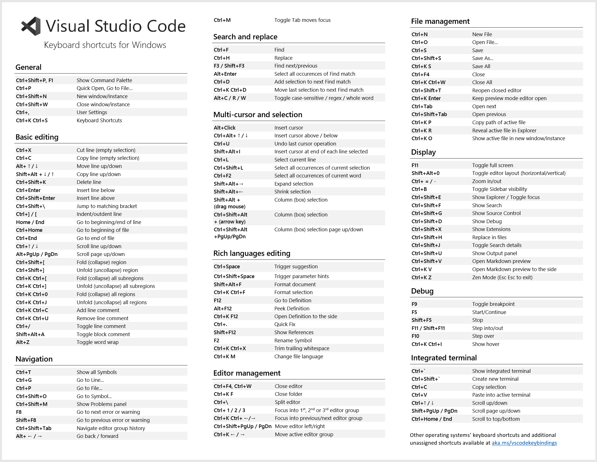

# Obsidian VSC Shortcuts

## Basic editing
- Obsidian Defaults
	- Ctrl+X Cut line (empty selection)
	- Ctrl+C Copy line (empty selection)
	- Ctrl+] / [ Indent/outdent line
	- Home / End Go to beginning/end of line
	- Ctrl+Home Go to beginning of file
	- Ctrl+End Go to end of file
- Features + roadmap
	- [x] Alt+ ↑ / ↓ Move line up/down
	- [x] Shift+Alt + ↓ / ↑ Copy line up/down
	- [x] Ctrl+Shift+K Delete line
	- [x] Ctrl+Enter Insert line below
	- [x] Ctrl+Shift+Enter Insert line above
	- [x] Ctrl+↑ / ↓ Scroll line up/down
	- [x] Alt+PgUp / PgDn Scroll page up/down
- Other vscode keybinds (likely will not add)
	- Ctrl+Shift+\ Jump to matching bracket (cs)
	- Ctrl+Shift+[ Fold (collapse) region (cs)
	- Ctrl+Shift+] Unfold (uncollapse) region (cs)
	- Ctrl+K Ctrl+[ Fold (collapse) all subregions (cs)
	- Ctrl+K Ctrl+] Unfold (uncollapse) all subregions (cs)
	- Ctrl+K Ctrl+0 Fold (collapse) all regions (cs)
	- Ctrl+K Ctrl+J Unfold (uncollapse) all regions (cs)
	- Ctrl+K Ctrl+C Add line comment (cs)
	- Ctrl+K Ctrl+U Remove line comment (cs)
	- Ctrl+/ Toggle line comment (cs)
	- Shift+Alt+A Toggle block comment (cs)
	- Alt+Z Toggle word wrap (not useful)

---

Further completing [timhor's editor shortcuts](https://github.com/timhor/obsidian-editor-shortcuts/)